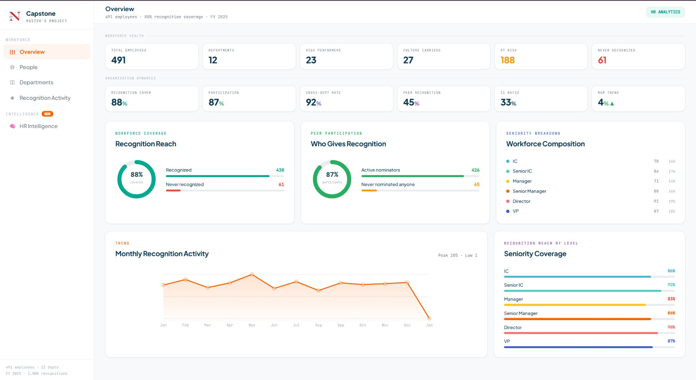
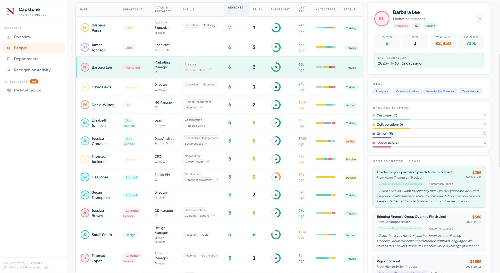
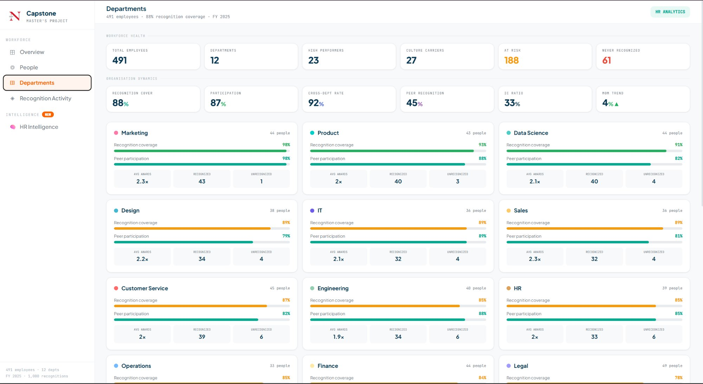
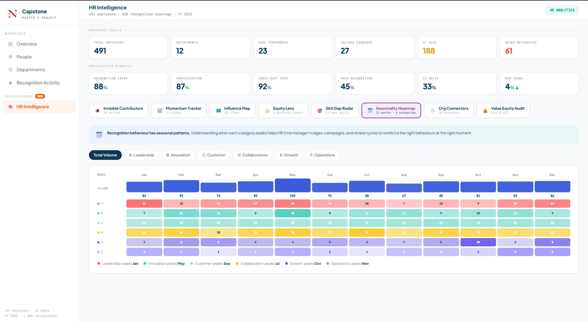

# 🏆 HR Recognition Analytics Dashboard

A full-stack data science project that transforms raw employee recognition data into actionable HR intelligence. Built in partnership with **Workhuman** as part of a Master's Capstone at **Northeastern University**.

---

## 📋 Table of Contents

- [Project Overview](#-project-overview)
- [Architecture](#-architecture)
- [Project Structure](#-project-structure)
- [Data Schema](#-data-schema)
- [Prerequisites](#-prerequisites)
- [Quick Start](#-quick-start)
- [Running the Analysis Pipeline](#-running-the-analysis-pipeline)
- [Running the Dashboard](#-running-the-dashboard)
- [Pipeline Deep Dive](#-pipeline-deep-dive)
- [Dashboard Features](#-dashboard-features)
- [Configuration Reference](#-configuration-reference)
- [Troubleshooting](#-troubleshooting)

---

## 🎯 Project Overview

This project processes employee recognition award data through a two-stage pipeline:

1. **Taxonomy Pipeline** — Uses LLMs (Claude / Gemini) and a local SLM (Ollama/Llama3) to automatically discover and refine a category taxonomy from recognition messages using grounded-theory methodology.

2. **Visualization Dashboard** — A Next.js dashboard that renders HR insights including recognition network graphs, culture health scorecards, department analytics, and message-level intelligence.

### Key Capabilities

- Automatically categorizes recognition messages into meaningful HR themes
- Surfaces recognition coverage gaps across departments and seniority levels
- Visualizes recognition networks to identify influence patterns
- Tracks culture health indicators per department
- Generates word cloud and thematic analysis of award language

---

## 📸 Screenshots

### Overview — Workforce Health & Recognition Reach

> KPI cards, recognition coverage donut charts, monthly trend line, and seniority breakdown.



---

### People — Employee Recognition Profiles

> Per-employee table with engagement scores, skills, days-since-last-recognition, and a detailed side panel with full recognition history.



---

### Departments — Coverage & Participation by Team

> Per-department cards showing recognition coverage %, peer participation %, average awards, and unrecognized headcount.



---

### HR Intelligence — Seasonality Heatmap & Advanced Analytics

> Advanced intelligence tools: Invisible Contributors, Momentum Tracker, Influence Map, Equity Lens, Skill Gap Radar, Seasonality Heatmap, Org Connectors, and Value Equity Audit.



---

## 🏗 Architecture

```
┌─────────────────────────────────────────────────────────┐
│                    DATA SOURCES (CSV)                    │
│  awards · employees · departments · skills · companies   │
└───────────────────────┬─────────────────────────────────┘
                        │
                        ▼
┌─────────────────────────────────────────────────────────┐
│               TAXONOMY PIPELINE  (Python)                │
│                                                          │
│  Phase 1: Claude / Gemini  →  Seed Taxonomy              │
│  Phase 2: Ollama / Llama3  →  Bulk Classification        │
│  Phase 3: Claude / Gemini  →  Finalize & Refine          │
└───────────────────────┬─────────────────────────────────┘
                        │  outputs annotated CSVs + JSON
                        ▼
┌─────────────────────────────────────────────────────────┐
│            NEXT.JS DASHBOARD  (TypeScript)               │
│                                                          │
│  Overview · Departments · People · Recognition Activity  │
│  HR Intelligence (Network · Culture Health · Messages)   │
└─────────────────────────────────────────────────────────┘
```

---

## 📁 Project Structure

```
project-root/
│
├── data/
│   └── raw/                        # Input CSV files
│       ├── awards.csv
│       ├── awards_enriched.csv
│       ├── mockup_awards.csv
│       ├── mockup_awards_enriched.csv
│       ├── employees.csv
│       ├── departments.csv
│       ├── companies.csv
│       ├── skills.csv
│       ├── employee_skills.csv
│       ├── categories.csv
│       ├── subcategories.csv
│       └── award_categories.csv
│
├── pipeline/                       # Python taxonomy pipeline
│   ├── config.py                   # All configuration & API keys
│   ├── defaults.py                 # Fallback taxonomy defaults
│   ├── utils.py                    # Shared helpers (LLM clients, CSV loading)
│   ├── phase_1_seed.py             # LLM discovers initial taxonomy
│   ├── phase_2_bulk.py             # Local SLM bulk-classifies messages
│   ├── phase_3_finalize.py         # LLM refines & finalizes taxonomy
│   ├── run_pipeline.py             # Main pipeline entry point
│   ├── run_comparison.py           # Run multiple provider configurations
│   ├── taxonomy_pipeline.py        # Original pipeline script
│   ├── taxonomy_pipeline_optimized.py
│   ├── estimate_employees.py
│   ├── generate_new_data.py
│   └── outputs/                    # Generated taxonomy + annotated data
│       ├── phase_1_taxonomy.json
│       ├── phase_2_classifications.json
│       ├── phase_3_final_taxonomy.json
│       ├── pipeline_summary.json
│       ├── checkpoints/            # Crash-recovery checkpoints
│       └── runs/                   # Multi-provider comparison runs
│
├── employee-dashboard/             # Next.js frontend
│   ├── app/
│   │   ├── dashboard/
│   │   │   ├── page.tsx            # Server component — loads CSV data
│   │   │   ├── HRDashboardClient.tsx  # Main interactive dashboard
│   │   │   └── HRIntelligenceSuite.tsx
│   │   ├── globals.css
│   │   └── layout.tsx
│   ├── lib/
│   │   ├── loadDashboardData.ts    # CSV → typed data aggregations
│   │   └── parseCSV.ts             # Custom CSV parser
│   ├── data/                       # Symlink or copy of data/raw/
│   ├── public/
│   ├── package.json
│   └── next.config.ts
│
├── taxonomy.json                   # Current taxonomy definition
├── compressed_taxonomy_with_ids.json
├── companies.json
├── departments.json
├── employees.json
└── README.md
```

---

## 🗂 Data Schema

| File | Rows | Description |
|------|------|-------------|
| `awards.csv` | 1,000+ | Core recognition records with messages, category tags, and monetary values |
| `awards_enriched.csv` | 1,000 | Awards with full recipient/nominator detail, taxonomy annotations |
| `mockup_awards_enriched.csv` | 2,000 | Extended mockup dataset for testing |
| `employees.csv` | 50–60 | Employee profiles, job titles, seniority, department assignments |
| `departments.csv` | 10–18 | Department info, headcounts, manager IDs |
| `companies.csv` | 3 | Parent company metadata |
| `skills.csv` | 10–36 | Skill definitions and categories |
| `employee_skills.csv` | 183 | Employee-to-skill mappings with proficiency levels |
| `categories.csv` | 6 | Recognition category definitions with colors |
| `subcategories.csv` | 18 | Subcategory breakdowns per category |

---

## ✅ Prerequisites

### For the Dashboard (Frontend)

| Requirement | Version |
|-------------|---------|
| Node.js | 18.x or higher |
| npm | 9.x or higher |

### For the Pipeline (Backend)

| Requirement | Version |
|-------------|---------|
| Python | 3.9 or higher |
| pip | latest |
| Ollama | latest (for Phase 2) |

### API Keys (at least one required for pipeline)

| Provider | Where to get it | Notes |
|----------|----------------|-------|
| Anthropic (Claude) | https://console.anthropic.com/settings/keys | Paid, highest quality |
| Google (Gemini) | https://aistudio.google.com/apikey | Free tier available |

---

## 🚀 Quick Start

### 1. Clone and navigate to the project

```bash
git clone <your-repo-url>
cd <project-root>
```

### 2. Set up your environment variables

Create a `.env` file in the project root:

```env
ANTHROPIC_API_KEY=sk-ant-...   # Optional: Claude API key
GOOGLE_API_KEY=AIza...          # Optional: Gemini API key
```

> At least one key is required to run the taxonomy pipeline. The dashboard works without any keys.

---

## 📊 Running the Dashboard

The dashboard is a Next.js app that reads CSV files directly from the `data/` folder.

### Step 1 — Install dependencies

```bash
cd employee-dashboard
npm install
```

### Step 2 — Make sure data files are in place

The dashboard reads from `employee-dashboard/data/`. Ensure your CSV files are there:

```bash
# From the project root:
cp data/raw/*.csv employee-dashboard/data/
```

Or create a symlink:

```bash
cd employee-dashboard
ln -s ../data/raw data
```

### Step 3 — Start the development server

```bash
npm run dev
```

Open [http://localhost:3000/dashboard](http://localhost:3000/dashboard) in your browser.

### Build for production

```bash
npm run build
npm start
```

---

## ⚙️ Running the Analysis Pipeline

The pipeline categorizes recognition messages using a 3-phase LLM approach.

### Step 1 — Install Python dependencies

```bash
cd pipeline
pip install -r requirements.txt
```

If you don't have a `requirements.txt`, install the core packages:

```bash
pip install anthropic google-generativeai pandas python-dotenv requests
```

### Step 2 — (Optional) Install Ollama for Phase 2

Phase 2 uses a local Llama3 model for bulk processing — this avoids API costs.

1. Download and install Ollama from https://ollama.ai
2. Pull the model:

```bash
ollama pull llama3:8b
```

3. Start the Ollama server (usually starts automatically):

```bash
ollama serve
```

### Step 3 — Run the full pipeline

```bash
cd pipeline
python run_pipeline.py
```

### Pipeline options

```bash
# Run only a specific phase
python run_pipeline.py --phase 1
python run_pipeline.py --phase 2
python run_pipeline.py --phase 3

# Skip Phase 2 (if Ollama is not available)
python run_pipeline.py --skip-phase2

# Force a specific LLM provider
python run_pipeline.py --provider claude
python run_pipeline.py --provider gemini

# Save results to a named run folder (for comparisons)
python run_pipeline.py --run-name my_experiment

# Compare multiple provider configurations
python run_comparison.py
```

### Phase 2 resume / crash recovery

Phase 2 automatically saves checkpoints every 20 batches. If it crashes, just re-run — it will resume from the last checkpoint automatically.

---

## 🔬 Pipeline Deep Dive

### Phase 1 — Taxonomy Discovery

A sample of 100 recognition messages is sent to Claude or Gemini. The LLM applies grounded theory to surface 6–8 meaningful categories with subcategories and descriptions. Output: `outputs/phase_1_taxonomy.json`.

### Phase 2 — Bulk Classification

All messages are classified in batches of 5 using a local Llama3 model via Ollama. This phase runs entirely offline with no API costs. It also surfaces candidate new categories that appear frequently but weren't in the Phase 1 taxonomy. Output: `outputs/phase_2_classifications.json`.

### Phase 3 — Taxonomy Finalization

Claude or Gemini reviews the Phase 1 taxonomy alongside Phase 2's candidate suggestions and produces a refined final taxonomy (max 8 categories, 4 subcategories each). Output: `outputs/phase_3_final_taxonomy.json`.

---

## 🖥 Dashboard Features

| Tab | What it shows |
|-----|--------------|
| **Overview** | KPI cards, monthly trend line, recognition coverage, category breakdown |
| **People** | Per-employee recognition summary, days-since-last-recognition, seniority heatmap |
| **Departments** | Department-level coverage, nomination participation rates, cross-department recognition |
| **Recognition Activity** | Award volume over time, top nominators, category distribution |
| **HR Intelligence** | Recognition Network Graph, Culture Health Scorecard, Message Word Cloud & Themes |

### HR Intelligence Suite highlights

- **Recognition Network Graph** — Force-directed graph showing who recognizes whom, surfacing informal influence hubs
- **Culture Health Scorecard** — Per-department scoring on consistency, participation, and cross-team recognition
- **Message Insights** — Word frequency cloud and thematic breakdown of award language

---

## ⚙️ Configuration Reference

All pipeline settings live in `pipeline/config.py`:

| Setting | Default | Description |
|---------|---------|-------------|
| `LLM_PROVIDER_PRIORITY` | `["claude", "gemini"]` | Provider fallback order |
| `P1_SAMPLE_SIZE` | `100` | Messages sampled for taxonomy discovery |
| `P2_BATCH_SIZE` | `5` | Messages per Ollama batch |
| `P2_MODEL` | `"llama3:8b"` | Local Ollama model tag |
| `P2_CHECKPOINT_EVERY` | `20` | Batches between checkpoint saves |
| `P3_MAX_MAIN_CATEGORIES` | `8` | Max final categories |
| `P3_MAX_SUBCATEGORIES` | `4` | Max subcategories per category |
| `LOG_LEVEL` | `"INFO"` | Logging verbosity |

---

## 🛠 Troubleshooting

**Dashboard shows no data**
→ Make sure CSV files are present in `employee-dashboard/data/` and are not empty.

**Pipeline: "No LLM API key found"**
→ Create a `.env` file in the project root with at least one of `ANTHROPIC_API_KEY` or `GOOGLE_API_KEY`.

**Pipeline Phase 2: "Ollama not running"**
→ Run `ollama serve` in a separate terminal, or use `--skip-phase2` to bypass it.

**Pipeline Phase 2: "model not found"**
→ Run `ollama pull llama3:8b` to download the model first.

**Dashboard: hydration or import errors**
→ Run `npm install` again and make sure you're on Node.js 18+.

**Phase 2 crashed mid-run**
→ Just re-run `python run_pipeline.py --phase 2` — it will resume from the last checkpoint automatically.

---

## 🧑‍💻 Development Notes

- The dashboard uses **Next.js Server Components** for data loading — all CSV parsing happens server-side with zero client-side fetching.
- The pipeline supports **multi-provider comparison** via `run_comparison.py`, saving separate output folders per run for side-by-side analysis.
- For larger datasets, consider upgrading the Phase 2 model to `qwen2.5:14b` via Ollama for improved classification accuracy.

---

## 📄 License

This project is part of a Master's Capstone program. All data is synthetic/anonymized for academic purposes.